# 🏆 S-Tier Image Pipeline — Blueprint Lengkap
## Dari "Functional" ke "World-Class" News Image Experience

---

## 📍 Posisi Saat Ini vs S-Tier

```
                    SAAT INI                              S-TIER TARGET
                ┌──────────────┐                     ┌──────────────────┐
  Upload        │ Sharp → WebP │  ✅ Solid            │ Sharp → WebP     │
                │ + Watermark  │                     │ + Watermark      │
                │ + Thumb 400  │                     │ + Thumb 400      │
                │              │                     │ + BlurHash       │
                │              │                     │ + Dominant Color │
                │              │                     │ + AVIF variant   │
                └──────┬───────┘                     └──────┬───────────┘
                       │                                    │
  Serving       ┌──────┴───────┐                     ┌──────┴───────────┐
                │ Nginx direct │  ✅ Solid            │ Nginx direct     │
                │ expires 30d  │                     │ + immutable      │
                │              │                     │ + Accept nego    │
                │              │                     │ + Brotli/AVIF    │
                └──────┬───────┘                     └──────┬───────────┘
                       │                                    │
  Render        ┌──────┴───────┐                     ┌──────┴───────────┐
                │ next/image   │  ⚠️ Basic           │ SmartImage       │
                │ fill + cover │                     │ + blur placeholder│
                │ no blur      │                     │ + fade-in anim   │
                │ no onError   │                     │ + error fallback │
                │ no sizes     │                     │ + responsive size│
                │ no thumb use │                     │ + LQIP/dominant  │
                │ no fade-in   │                     │ + connection-awar│
                └──────────────┘                     └──────────────────┘
```

---

## 🎯 7 Tier Peningkatan (Urut Prioritas)

---

### TIER 1: Blur Hash Generation (Server-Side)
**Impact: 🔥🔥🔥🔥🔥 | Effort: ⏱️ 2-3 jam**

#### Apa yang harus dilakukan:

**✅ 1.1 — Prisma Schema Migration**

| Model | Perubahan |
|-------|-----------|
| `Media` | Tambah `blurHash String?` |
| `Article` | Tambah `featuredImageBlur String?` |

Kenapa dua field? Karena `Article.featuredImage` adalah URL langsung (bukan relasi ke `Media`). Saat jurnalis set featured image, blur hash harus ikut disimpan di level Article juga agar API response public tidak perlu JOIN ke tabel Media.

**✅ 1.2 — media.controller.ts: Generate blur saat upload**

Setelah Sharp memproses image, tambah 1 step:

```
Buffer → Sharp resize(10, 10) → toBuffer('webp') → base64 encode
→ "data:image/webp;base64,UklGR..." (~100-200 bytes)
→ Simpan ke Media.blurHash
```

Ini cost hampir nol — resize ke 10x10 pixel memakan ~1ms.

**✅ 1.3 — Article service: Propagate blur ke article**

Saat jurnalis set `featuredImage` URL, lookup `Media` table berdasarkan URL → copy `blurHash` ke `Article.featuredImageBlur`.

**✅ 1.4 — API public response: Include blur data**

Endpoint `GET /api/v1/articles/public` harus include `featuredImageBlur` di response.

**✅ 1.5 — Frontend: Semua `<Image>` komponen pakai blur**

```tsx
<Image 
  src={imageUrl}
  placeholder="blur"
  blurDataURL={article.featuredImageBlur || FALLBACK_BLUR}
  // ...
/>
```

**✅ 1.6 — Backfill Script: Generate blur untuk artikel lama**

Script one-time yang membaca semua existing images di `/uploads/`, generate blur hash, dan update database.

---

### TIER 2: Smart Image Wrapper Component
**Impact: 🔥🔥🔥🔥 | Effort: ⏱️ 2-3 jam**

#### Masalah saat ini:
- **13 file** menggunakan `<Image>` dari next/image secara langsung
- Setiap file mengulang pattern yang sama (fallback URL, className, transition)
- **Zero error handling** — jika image gagal load, broken image icon muncul
- Tidak ada fade-in transition saat image selesai load
- Tidak ada fallback ke thumbnail (`thumbUrl`) saat koneksi lambat

#### Yang harus dibangun — `<SmartImage>` component:

```
File: components/ui/SmartImage.tsx
```

| Fitur | Detail |
|-------|--------|
| **Blur placeholder** | Otomatis pakai `blurDataURL` jika tersedia |
| **Fade-in on load** | CSS opacity transition dari 0 → 1 saat `onLoad` |
| **Error fallback** | `onError` → tampilkan gradient + icon kamera, bukan broken image |
| **Fallback chain** | `src` gagal → coba `thumbUrl` → coba static fallback |
| **Dominant color bg** | Background container = dominant color (bukan abu-abu kosong) |
| **Loading state** | Shimmer animation sampai image loaded |
| **`sizes` prop** | Auto-calculate berdasarkan context (card vs hero vs thumbnail) |

#### Usage di seluruh codebase:

```tsx
// Sebelum (tersebar di 13 file):
<Image src={imageUrl} alt={title} fill className="object-cover ..." />

// Sesudah (1 component, 1 API):
<SmartImage 
  src={imageUrl}
  blur={article.featuredImageBlur}
  alt={title}
  context="card"       // → auto sizes="(max-width: 768px) 100vw, 50vw"
  priority={isHero}
/>
```

#### File yang harus diupdate:

| File | Jumlah `<Image>` | Ganti ke `<SmartImage>` |
|------|:-:|:-:|
| `NewsCard.tsx` | 4 | ✅ |
| `MagazineBentoHero.tsx` | 4 | ✅ |
| `PremiumHero.tsx` | 1 | ✅ |
| `PublicGallery.tsx` | 3 | ✅ |
| `VideoWidget.tsx` | 1 | ✅ |
| `Navbar.tsx` (logo) | 1 | ✅ |
| `artikel/[slug]/page.tsx` | 3 | ✅ |
| Editor blocks (4 files) | 4 | ⚠️ Optional |
| **Total** | **~21** | |

---

### TIER 3: Responsive `sizes` Optimization
**Impact: 🔥🔥🔥🔥 | Effort: ⏱️ 1 jam**

#### Masalah saat ini:
Tidak ada satupun `<Image>` yang menggunakan prop `sizes`. Ini berarti Next.js **selalu mengirim gambar terlebar** (default `100vw`) — bahkan untuk card kecil di sidebar yang hanya 300px wide.

#### Yang harus dilakukan:

| Context | `sizes` yang benar | Bandwidth saving |
|---------|-------------------|-:|
| **Hero lead** (8 col) | `(max-width: 768px) 100vw, 66vw` | ~20% |
| **Hero side** (4 col) | `(max-width: 768px) 100vw, 33vw` | ~50% |
| **News card medium** (2 col grid) | `(max-width: 768px) 100vw, 50vw` | ~40% |
| **News card horizontal** (thumbnail) | `(max-width: 768px) 33vw, 200px` | ~70% |
| **Sidebar popular** (minimal) | Tidak ada image — OK |
| **Gallery thumbnail** | `56px` | ~90% |
| **Gallery lightbox** | `100vw` | 0% (already max) |
| **Article cover** | `100vw` | 0% |

**Total estimated bandwidth saving: 30-50% per page load.**

Jika menggunakan `<SmartImage>` dari Tier 2, ini bisa di-encode sebagai `context` prop:

```tsx
const SIZES_MAP = {
  hero_lead: '(max-width: 768px) 100vw, 66vw',
  hero_side: '(max-width: 768px) 100vw, 33vw',
  card: '(max-width: 768px) 100vw, (max-width: 1200px) 50vw, 600px',
  card_horizontal: '(max-width: 768px) 33vw, 200px',
  gallery_thumb: '56px',
  gallery_full: '100vw',
  article_cover: '100vw',
}
```

---

### TIER 4: AVIF Support & Nginx Optimization
**Impact: 🔥🔥🔥 | Effort: ⏱️ 1-2 jam**

#### Masalah saat ini:
- Backend hanya generate WebP. AVIF memberikan **20-30% lebih kecil** dari WebP dengan kualitas visual identik
- Next.js image optimization sudah bisa serve AVIF, tapi `next.config.mjs` tidak mengonfigurasi format preferences
- Nginx tidak mengompres dengan Brotli (hanya gzip)

#### Yang harus dilakukan:

**4.1 — next.config.mjs: Enable AVIF**

```js
images: {
  formats: ['image/avif', 'image/webp'],  // ← Tambah ini
  // ... existing config
}
```

Next.js akan otomatis serve AVIF ke browser yang support (Chrome 85+, Firefox 93+) dan fallback ke WebP.

**4.2 — Nginx: Immutable cache + content negotiation**

```nginx
location /api/v1/media/uploads/ {
    alias /opt/beritakarya/uploads/;
    expires 365d;                                    # 30d → 1 tahun
    add_header Cache-Control "public, immutable";    # Browser tidak perlu revalidate
    add_header Vary "Accept";                        # Untuk future AVIF serving
}
```

`immutable` adalah game-changer — browser **tidak pernah** re-request gambar yang sudah ada di cache, bahkan saat refresh. Aman karena filename adalah UUID (content-addressable).

**4.3 — Backend: Optional AVIF generation (Future)**

Saat Sharp memproses, tambahkan AVIF variant:
```
sharp(buffer).avif({ quality: 60 }).toFile(`${uuid}.avif`)
```

Lalu Nginx bisa serve AVIF langsung (tanpa Next.js proxy) berdasarkan `Accept` header. Ini menghilangkan dependency ke Next.js image optimization untuk mobile clients.

---

### TIER 5: Dominant Color Extraction
**Impact: 🔥🔥🔥 | Effort: ⏱️ 1-2 jam**

#### Masalah saat ini:
Saat gambar loading, container hanya menampilkan `bg-gray-100` (abu-abu flat). Ini terasa generik dan tidak memberikan hint visual tentang gambar yang akan muncul.

#### Yang harus dilakukan:

**5.1 — Backend: Extract dominant color saat upload**

```ts
const { dominant } = await sharp(buffer).stats()
// → { r: 43, g: 87, b: 156 } → "#2B579C"
```

Simpan di `Media.dominantColor String?`

**5.2 — API: Include di response**

```json
{
  "featuredImage": "https://...",
  "featuredImageBlur": "data:image/webp;base64,...",
  "featuredImageColor": "#2B579C"
}
```

**5.3 — Frontend: Dynamic background**

```tsx
<div 
  className="relative aspect-video overflow-hidden rounded-xl"
  style={{ backgroundColor: article.featuredImageColor || '#F1F5F9' }}
>
  <SmartImage ... />
</div>
```

#### Visual effect:
```
Sebelum: [████ ABU-ABU KOSONG ████] → [GAMBAR MUNCUL TIBA-TIBA]

Sesudah: [████ BIRU OCEAN ████████] → [blur biru] → [GAMBAR FADE-IN MULUS]
         (warna dominan gambar)        (blur hint)    (crystal clear)
```

Ini teknik yang digunakan oleh **Google Photos, Pinterest, dan Instagram**.

---

### TIER 6: Progressive Image Loading Architecture
**Impact: 🔥🔥 | Effort: ⏱️ 3-4 jam**

#### Ini adalah "the final boss" — arsitektur loading multi-layer:

```
Layer 1: Dominant Color background         (~0ms, inline style)
Layer 2: BlurHash (10x10 base64)           (~0ms, inline data URI)
Layer 3: Thumbnail (400px WebP)            (~50-200ms, network)
Layer 4: Full image (1920px WebP/AVIF)     (~200-2000ms, network)
```

#### Yang harus dilakukan:

**6.1 — Connection-aware loading**

```tsx
// Detect slow connections
const connection = navigator.connection
const isSlowConnection = connection?.effectiveType === '2g' || connection?.effectiveType === '3g'

// On slow connections: load thumbnail first, then full on interaction
// On fast connections: load full directly with blur placeholder
```

**6.2 — Viewport-aware priority**

```tsx
// Above-the-fold images: priority={true} → preload in <head>
// Below-the-fold images: lazy loading + IntersectionObserver

// Hero: ALWAYS priority
// First 4 cards: priority on desktop, lazy on mobile
// Rest: lazy
```

**6.3 — Prefetch on hover**

```tsx
// When user hovers a news card, prefetch the article's cover image
// So when they click, the article page image is already cached
const prefetchImage = (url: string) => {
  const link = document.createElement('link')
  link.rel = 'prefetch'
  link.as = 'image'
  link.href = url
  document.head.appendChild(link)
}
```

**6.4 — `thumbUrl` sebagai intermediate placeholder**

Backend sudah generate thumbnail 400px tapi frontend **sama sekali tidak menggunakannya**. Dengan progressive loading:

```tsx
// Step 1: Show blurHash (instant)
// Step 2: Load thumbUrl (400px, ~20KB, fast)
// Step 3: Swap to full image when loaded (1920px)
```

Ini eliminates the "sudden pop-in" completely — bahkan di koneksi lambat.

---

### TIER 7: CDN Layer (Cloudinary Activation)
**Impact: 🔥🔥 | Effort: ⏱️ 4-6 jam**

#### Status saat ini:
Konfigurasi Cloudinary **sudah ada** di `.env` tapi **tidak digunakan**:
```
CLOUDINARY_CLOUD_NAME=dhyrfofkt
CLOUDINARY_API_KEY=674999717273191
CLOUDINARY_API_SECRET=XatHkHc1mrF-LoDdKsFDbYLot1w
```

#### Mengapa ini S-Tier:
- Cloudinary punya **100+ edge PoP** global — image di-serve dari server terdekat ke pembaca
- On-the-fly transformation: resize, crop, format nego, quality auto
- Built-in blur placeholder generation via URL parameter
- Analytics: heat maps, format distribution, bandwidth usage

#### Yang harus dilakukan:

**7.1 — Dual-write strategy**

Saat upload:
1. Simpan ke local disk (existing) — untuk backup & Nginx serving
2. Upload ke Cloudinary — untuk CDN serving

**7.2 — Smart URL resolution**

```tsx
function getImageUrl(article: Article) {
  // Production: use Cloudinary CDN
  if (process.env.NODE_ENV === 'production' && article.cloudinaryId) {
    return `https://res.cloudinary.com/${CLOUD}/image/upload/f_auto,q_auto,w_auto/${article.cloudinaryId}`
  }
  // Fallback: original API URL
  return article.featuredImage
}
```

`f_auto,q_auto,w_auto` = Cloudinary otomatis pilih format (AVIF/WebP/JPEG) dan quality berdasarkan browser & bandwidth. Zero config di frontend.

**7.3 — next.config.mjs: Add Cloudinary domain**

```js
remotePatterns: [
  // ... existing
  { protocol: 'https', hostname: 'res.cloudinary.com' },
]
```

---

## 📊 Impact Matrix

| Tier | Fitur | LCP Impact | UX Impact | Bandwidth | Effort |
|:----:|-------|:----------:|:---------:|:---------:|:------:|
| 1 | Blur Hash | ⭐⭐⭐⭐ | ⭐⭐⭐⭐⭐ | ~0 | 2-3h |
| 2 | SmartImage Component | ⭐⭐⭐ | ⭐⭐⭐⭐⭐ | ⭐⭐ | 2-3h |
| 3 | Responsive `sizes` | ⭐⭐⭐⭐ | ⭐⭐ | ⭐⭐⭐⭐⭐ | 1h |
| 4 | AVIF + Nginx | ⭐⭐⭐ | ⭐ | ⭐⭐⭐⭐ | 1-2h |
| 5 | Dominant Color | ⭐⭐ | ⭐⭐⭐⭐ | ~0 | 1-2h |
| 6 | Progressive Loading | ⭐⭐⭐⭐⭐ | ⭐⭐⭐⭐⭐ | ⭐⭐⭐ | 3-4h |
| 7 | Cloudinary CDN | ⭐⭐⭐⭐⭐ | ⭐⭐⭐ | ⭐⭐⭐⭐⭐ | 4-6h |

---

## 🗺️ Execution Roadmap

```mermaid
gantt
    title S-Tier Image Pipeline Roadmap
    dateFormat HH:mm
    axisFormat %H:%M

    section Phase 1 - Foundation
    Tier 1: Blur Hash (Schema + Backend + Frontend)    :t1, 00:00, 3h
    Tier 3: Responsive sizes                           :t3, after t1, 1h

    section Phase 2 - Smart Component
    Tier 2: SmartImage wrapper                         :t2, after t3, 3h
    Tier 5: Dominant Color extraction                  :t5, after t2, 2h

    section Phase 3 - Optimization
    Tier 4: AVIF + Nginx tuning                        :t4, after t5, 2h
    Tier 6: Progressive loading                        :t6, after t4, 4h

    section Phase 4 - CDN
    Tier 7: Cloudinary integration                     :t7, after t6, 6h
```



**Total estimated effort: ~17-21 jam kerja** (bisa diselesaikan dalam 2-3 hari sprint)

---

## 🎯 S-Tier Definition of Done

Ketika semua 7 tier selesai, ini yang akan dialami pembaca:

```
1. Buka beritakarya.co di HP (3G connection)
   → Navbar instant, hero container tampil dengan warna biru ocean (dominant color)
   → 50ms: blur preview muncul — pembaca sudah bisa "membaca" gambar
   → 200ms: thumbnail 400px swap in, sudah cukup jelas
   → 800ms: full AVIF image fade-in mulus — crystal clear
   → Total perceived loading: ~200ms (bukan 2000ms seperti sekarang)

2. Scroll ke bawah
   → Card images lazy load dengan blur → sharp transition
   → Tidak ada "pop-in" yang mengejutkan
   → Bandwidth hemat 40-50% karena responsive sizes + AVIF

3. Hover card berita
   → Article cover image sudah di-prefetch
   → Klik → article page → cover image instant (dari cache)

4. Image gagal load (server error)
   → Bukan broken image icon
   → Gradient cantik + camera icon + "Gambar tidak tersedia"
   → Fallback ke thumbnail → fallback ke gradient
```

> **Ini bukan sekadar blur placeholder — ini arsitektur image loading yang setara dengan The New York Times, Medium, dan Google Photos.**

---

## ⚠️ Catatan Penting

1. **Tier 1-3 adalah mandatory minimum** untuk keluar dari "basic" ke "professional"
2. **Tier 4-5 memberikan polish** yang membedakan "good" dari "great"
3. **Tier 6-7 adalah "S-Tier exclusive"** — hanya portal berita kelas dunia yang melakukan ini
4. **Backfill script** (Tier 1.6) harus dijalankan hati-hati di production — gunakan batching dan jangan saturate disk I/O
5. **Cloudinary** (Tier 7) memiliki free tier yang cukup untuk scale awal, tapi akan butuh paid plan jika traffic tinggi

Siap untuk mulai eksekusi? Saya merekomendasikan memulai dari **Tier 1 + Tier 3** dulu — ini memberikan impact terbesar dengan effort terkecil.
