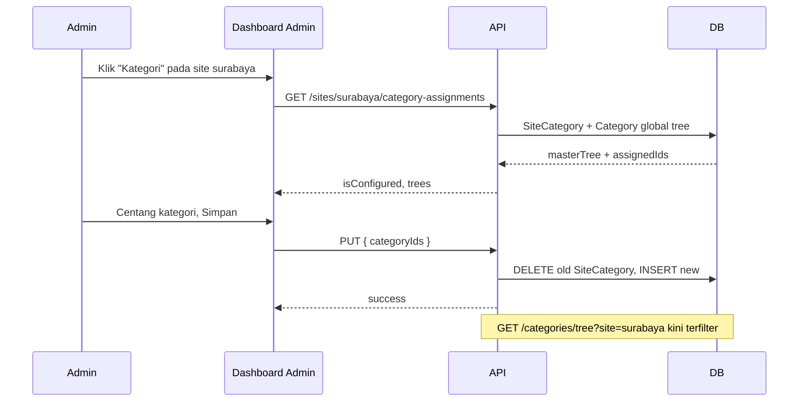

# Implementation Plan — Kategori per Sub-Site (Multi-Tenant)

> **Tujuan:** Superadmin dapat menentukan kategori mana saja yang aktif untuk setiap sub-site, menggunakan **kategori master yang sudah ada** (global / `CATEGORIES_CONFIG`), tanpa membuat slug/nama baru dari nol.  
> **Lokasi UI:** Dashboard Admin → **Manajemen Situs** (`apps/web/app/[site]/dashboard/admin/page.tsx`)  
> **Tanggal draft:** 1 Juni 2026  
> **Status:** Draft — siap dikerjakan bertahap

---

## Daftar Isi

1. [Ringkasan & Latar Belakang](#1-ringkasan--latar-belakang)
2. [Keputusan Desain](#2-keputusan-desain)
3. [Perilaku Sistem (Before / After)](#3-perilaku-sistem-before--after)
4. [Skema Database](#4-skema-database)
5. [API Contract](#5-api-contract)
6. [Perubahan Backend](#6-perubahan-backend)
7. [Perubahan Frontend](#7-perubahan-frontend)
8. [Migrasi Data & Backward Compatibility](#8-migrasi-data--backward-compatibility)
9. [Fase Pengerjaan](#9-fase-pengerjaan)
10. [Testing](#10-testing)
11. [Deployment (VPS + Vercel)](#11-deployment-vps--vercel)
12. [Risiko & Mitigasi](#12-risiko--mitigasi)
13. [Out of Scope](#13-out-of-scope)
14. [Checklist File](#14-checklist-file)

---

## 1. Ringkasan & Latar Belakang

### Masalah saat ini

| Area | Kondisi |
|------|---------|
| **Manajemen Situs** | Hanya CRUD: Site ID, domain, nama, email. Tidak ada konfigurasi kategori. |
| **Kategori di API** | `getSiteCategories(siteId)` mengembalikan **semua** kategori global (`isGlobal: true`) + kategori milik site. |
| **Provisioning** | Wapimred/superadmin harus ke `/{site}/dashboard/categories` per site dan klik **Seed defaults** manual. |
| **Master list** | `CATEGORIES_CONFIG` (`apps/web/lib/constants.ts`) + record DB global — belum ada **allowlist per tenant**. |

### Hasil yang diinginkan

1. Di halaman **Manajemen Situs**, superadmin membuka dialog **“Kelola Kategori”** per baris site.
2. UI menampilkan **pohon kategori master** (global) — checkbox parent + children.
3. Menyimpan pilihan → sub-site hanya menampilkan kategori terpilih di navbar publik, editor, dan filter artikel.
4. Site baru bisa langsung dipilih kategorinya saat dibuat (opsional di fase 2).
5. Site yang belum pernah dikonfigurasi tetap berperilaku seperti sekarang (**tidak breaking**).

### Konteks infrastruktur (tidak diubah)

- **Frontend:** Vercel, wildcard `*.beritakarya.co` → `apps/web/proxy.ts` resolve `siteId` dari subdomain.
- **API:** VPS `api.beritakarya.co` — deploy via `infra/docker/docker-compose.backend.yml` (lihat `VPS_DEPLOYMENT_GUIDE.md`).
- Subdomain baru otomatis resolve setelah baris `Site` ada di DB; fitur ini **hanya menambah data & filter**, bukan DNS.

---

## 2. Keputusan Desain

### Dipilih: **Opsi A — Junction table `SiteCategory`**

```
Site (1) ──< SiteCategory >── (N) Category
```

| Opsi | Kelebihan | Kekurangan | Keputusan |
|------|-----------|------------|-----------|
| **A. `SiteCategory`** | Relasi eksplisit, FK integrity, mudah audit, query jelas | Perlu migrasi + endpoint baru | ✅ **Dipilih** |
| B. JSON `enabledCategorySlugs` di `Site` | Implementasi cepat | Sulit FK, hierarki parent/child manual | ❌ |
| C. Duplikasi record `Category` per site saat assign | Tidak ubah query banyak | Duplikasi data, sync slug ribet | ❌ |

### Aturan bisnis

1. **Hanya kategori global** (`isGlobal: true`, `siteId = null`) yang bisa di-assign ke site via UI ini.  
   - Kategori custom per-site (dibuat di `/dashboard/categories`) tetap selalu tampil untuk site tersebut.
2. Jika parent dicentang → **semua subkategori global** ikut aktif (cascade down).  
   Jika parent tidak dicentang tetapi child dicentang → parent ikut disertakan di tree (untuk navigasi), atau UI memaksa centang parent — **pilih saat implementasi UI: auto-centang parent jika ada child terpilih**.
3. Site **`pusat`**: boleh dikonfigurasi; default = semua global (sama seperti site lain yang belum dikonfigurasi).
4. Menghapus site → cascade delete `SiteCategory` (via Prisma `onDelete: Cascade`).
5. Menghapus kategori global → cascade delete baris `SiteCategory` terkait.

### Sumber daftar master di UI admin

**Prioritas:** `GET /api/v1/categories/tree?view=global` (data DB).  
**Fallback UI:** flatten `CATEGORIES_CONFIG` jika global DB kosong — tampilkan peringatan “Seed kategori global dulu”.

---

## 3. Perilaku Sistem (Before / After)

### Before

```
getSiteCategories(siteId):
  WHERE siteId = X OR isGlobal = true
```

### After

```
getSiteCategories(siteId):
  1. siteCategories = SiteCategory WHERE siteId = X
  2. IF siteCategories.length > 0:
       return global categories WHERE id IN (assignedIds)
              + site-specific categories WHERE siteId = X
              + include ancestors of assigned children (untuk tree utuh)
     ELSE:
       return perilaku lama (global + site-specific)  // backward compatible
```

### Dampak ke consumer

| Consumer | Perubahan |
|----------|-----------|
| `PublicSiteLayout` → `/categories/tree?site=` | Otomatis terfilter setelah service diubah |
| `TabSettings` / editor | Pakai tree yang sama |
| `article.service` validasi kategori | Pastikan kategori artikel masih dalam set yang diizinkan (cek di fase 3) |
| Statistik `stats.categories` di Manajemen Situs | Tetap hitung `Category` dengan `siteId = X`; opsional tambah kolom “ter-assign” |

---

## 4. Skema Database

### 4.1 Model baru (Prisma)

**File:** `apps/api/prisma/schema.prisma`

```prisma
model SiteCategory {
  siteId     String   @map("site_id")
  categoryId String   @map("category_id")
  createdAt  DateTime @default(now()) @map("created_at")

  site     Site     @relation(fields: [siteId], references: [id], onDelete: Cascade)
  category Category @relation(fields: [categoryId], references: [id], onDelete: Cascade)

  @@id([siteId, categoryId])
  @@index([categoryId])
  @@map("site_categories")
}
```

Tambahkan relasi di model `Site` dan `Category`:

```prisma
// Site
siteCategories SiteCategory[]

// Category
siteAssignments SiteCategory[]
```

### 4.2 Migrasi

```bash
cd apps/api
pnpm prisma migrate dev --name add_site_categories
```

**Nama migrasi produksi:** `add_site_categories`

### 4.3 Script data (opsional, fase 4)

`apps/api/scripts/backfill-site-categories.ts`:

- Untuk setiap site yang sudah punya kategori `siteId = X` (hasil seed manual), infer allowlist dari slug yang ada.
- Atau: assign semua global ke `pusat` saja.

---

## 5. API Contract

Semua endpoint di bawah **`/api/v1/sites/:siteId/categories`** — **superadmin only** (`requireAuth`, `requireRole(['superadmin'])`).

### 5.1 GET — Daftar kategori ter-assign + master

```
GET /api/v1/sites/:siteId/categories
```

**Response 200:**

```json
{
  "success": true,
  "data": {
    "siteId": "surabaya",
    "isConfigured": true,
    "assignedCategoryIds": ["uuid-1", "uuid-2"],
    "masterTree": [ /* pohon kategori global, sama shape /categories/tree */ ],
    "assignedTree": [ /* subset yang aktif */ ]
  }
}
```

- `isConfigured: false` → belum ada baris di `SiteCategory` (fallback perilaku lama).

### 5.2 PUT — Ganti seluruh allowlist (replace)

```
PUT /api/v1/sites/:siteId/categories
Content-Type: application/json

{
  "categoryIds": ["uuid-1", "uuid-2", "uuid-3"]
}
```

**Validasi:**

- `siteId` harus exist.
- Setiap `categoryId` harus exist, `isGlobal === true`, `deletedAt === null`.
- Jika child ID dikirim tanpa parent → server **auto-include parent** global (recommended).

**Response 200:**

```json
{
  "success": true,
  "data": {
    "siteId": "surabaya",
    "assignedCategoryIds": ["..."],
    "count": 12
  }
}
```

**Audit log:** `site.categories_updated` (entityType: `site`, entityId: siteId).

### 5.3 POST create site (perluasan opsional — Fase 2)

```
POST /api/v1/sites
{
  "id": "surabaya",
  "domain": "surabaya.beritakarya.co",
  "name": "BeritaKarya Surabaya",
  "contactEmail": "...",
  "categoryIds": ["uuid-1", "..."]   // optional
}
```

Jika `categoryIds` dikirim → panggil logic yang sama dengan PUT setelah `createSite`.

### 5.4 Error codes

| Code | HTTP | Kondisi |
|------|------|---------|
| `SITE_NOT_FOUND` | 404 | siteId tidak ada |
| `INVALID_CATEGORY_IDS` | 400 | ID tidak global / tidak ditemukan |
| `FORBIDDEN` | 403 | bukan superadmin |
| `SITE_CATEGORIES_UPDATE_FAILED` | 500 | error internal |

### 5.5 Registrasi route

**File:** `apps/api/src/main.ts` (setelah route sites lain):

```typescript
app.get('/api/v1/sites/:siteId/categories',
  requireAuth, requireRole(['superadmin']),
  asyncHandler(siteController.getSiteCategories))

app.put('/api/v1/sites/:siteId/categories',
  requireAuth, requireRole(['superadmin']),
  asyncHandler(siteController.updateSiteCategories))
```

> **Urutan route:** Daftarkan **sebelum** `GET /api/v1/sites/:id` jika path bentrok — atau gunakan path `/sites/:siteId/category-assignments` jika Express match `:id` = `categories`.  
> **Rekomendasi aman:** gunakan segment tetap:  
> `GET/PUT /api/v1/sites/:siteId/category-assignments`

---

## 6. Perubahan Backend

### 6.1 File baru

| File | Tanggung jawab |
|------|----------------|
| `apps/api/src/modules/site/site-category.service.ts` | `getAssignments`, `replaceAssignments`, `resolveCategoryIdsWithParents` |
| (opsional) `site-category.service.test.ts` | Unit test replace + parent cascade |

### 6.2 File diubah

| File | Perubahan |
|------|-----------|
| `apps/api/prisma/schema.prisma` | Model `SiteCategory` + relasi |
| `apps/api/src/modules/site/site.controller.ts` | Handler GET/PUT assignments |
| `apps/api/src/modules/site/site.service.ts` | (opsional) panggil assign saat `createSite` |
| `apps/api/src/modules/category/category.service.ts` | `getSiteCategories`, `getCategoryTree` — filter by assignment |
| `apps/api/src/main.ts` | Register routes |
| `packages/types` (jika ada) | Type `SiteCategoryAssignmentResponse` |

### 6.3 Logic inti — `category.service.ts`

Pseudo:

```typescript
async getSiteCategories(siteId: string) {
  const assignments = await prisma.siteCategory.findMany({ where: { siteId } })

  if (assignments.length === 0) {
    // LEGACY: perilaku sekarang
    return this.legacyGetSiteCategories(siteId)
  }

  const assignedIds = assignments.map(a => a.categoryId)
  // Expand: include parent chain untuk tree
  const expandedIds = await this.expandWithAncestors(assignedIds)

  const all = await prisma.category.findMany({
    where: {
      OR: [
        { id: { in: expandedIds }, isGlobal: true },
        { siteId }
      ]
    },
    ...
  })
  return this.deduplicateCategories(all, siteId)
}
```

Extract `legacyGetSiteCategories` dari kode existing agar diff jelas.

### 6.4 Validasi artikel (Fase 3 — disarankan)

**File:** `apps/api/src/modules/article/article.service.ts`

Saat create/update artikel dengan `categoryId`:

- Jika site punya assignment → `categoryId` harus dalam expanded set ATAU site-specific category.

---

## 7. Perubahan Frontend

### 7.1 Komponen baru

| File | Deskripsi |
|------|-----------|
| `apps/web/app/[site]/dashboard/admin/components/SiteCategoriesDialog.tsx` | Modal: load master tree, checkbox, simpan PUT |
| `apps/web/app/[site]/dashboard/admin/components/CategoryTreePicker.tsx` | Presentational: render tree + indeterminate parent checkbox |

### 7.2 File diubah

| File | Perubahan |
|------|-----------|
| `apps/web/app/[site]/dashboard/admin/page.tsx` | Tombol **Kategori** per row → buka `SiteCategoriesDialog` |
| `apps/web/lib/api.ts` | (jika perlu) helper typed calls — opsional |

### 7.3 UX — `SiteCategoriesDialog`

1. Props: `site: { id, name }`, `open`, `onClose`, `onSaved`.
2. Mount → `GET /sites/:id/category-assignments`.
3. Tampilkan:
   - Judul: `Kategori — {site.name}`
   - Subtitle: “Pilih kategori master yang aktif di portal ini”
   - Tree checkbox (parent/child)
   - Badge: `Belum dikonfigurasi — menampilkan semua kategori global` jika `!isConfigured`
4. Tombol:
   - **Simpan** → PUT dengan `categoryIds[]`
   - **Pilih semua** / **Hapus semua** (shortcut)
   - **Batal**
5. Toast sukses/error — pola sama dengan dialog situs existing.
6. Loading skeleton saat fetch.

### 7.4 Tombol di tabel Manajemen Situs

Di kolom **Aksi**, tambah:

```text
[ Edit ] [ Kategori ] [ Hapus ]
```

- `Kategori` disabled untuk site yang tidak exist (N/A).
- Icon: `FolderOpen` atau `Tags` (Lucide).

### 7.5 (Fase 2) Form buat situs

Di modal **Tambahkan Portal Berita**, section collapsible:

- “Kategori awal (opsional)” — `CategoryTreePicker` compact.
- Jika kosong → site baru pakai fallback legacy sampai admin assign manual.

---

## 8. Migrasi Data & Backward Compatibility

### Strategi

| Skenario | Perilaku |
|----------|----------|
| Site tanpa baris `SiteCategory` | Semua global + site-specific ( **sama seperti hari ini** ) |
| Site dengan ≥1 assignment | Hanya global terpilih + site-specific |
| Global DB kosong | UI arahkan ke `/pusat/dashboard/categories` → seed global |

### Urutan deploy aman

1. Deploy migrasi DB (tabel kosong) — **tidak mengubah perilaku**.
2. Deploy API dengan logic filter — masih legacy karena tabel kosong.
3. Deploy frontend dialog admin.
4. Superadmin assign per site secara bertahap.
5. (Opsional) Script backfill untuk site produksi.

### Rollback

- Hapus semua baris `SiteCategory` → sistem kembali ke perilaku lama tanpa rollback code.
- Rollback code: deploy versi API sebelumnya; tabel boleh dibiarkan.

---

## 9. Fase Pengerjaan

### Fase 1 — Foundation (Backend) ⏱ ~½ hari

- [x] Tambah model `SiteCategory` + migrasi Prisma
- [x] `site-category.service.ts`: get + replace + expand ancestors
- [x] Controller + routes `category-assignments`
- [x] Audit log `site.categories_updated`
- [x] `pnpm --filter api type-check`

### Fase 2 — Filter kategori (Backend) ⏱ ~½ hari

- [ ] Refactor `category.service.ts` — `getSiteCategories` + `getCategoryTree`
- [ ] Unit test: site tanpa assignment vs dengan assignment
- [ ] Manual test: `curl` tree untuk `bandung` sebelum/sesudah assign

### Fase 3 — UI Admin ⏱ ~1 hari

- [ ] `CategoryTreePicker.tsx`
- [ ] `SiteCategoriesDialog.tsx`
- [ ] Integrasi ke `admin/page.tsx` — tombol per row
- [ ] `pnpm --filter web typecheck`

### Fase 4 — Polish & validasi ⏱ ~½ hari

- [ ] Validasi `categoryId` di `article.service` saat site configured
- [ ] (Opsional) `categoryIds` di POST create site
- [ ] (Opsional) script `backfill-site-categories.ts`
- [ ] Update `docs/ARCHITECTURE.md` — bagian Multi-Tenant / Categories

### Fase 5 — Deploy ⏱ ~30 menit

- [ ] Merge ke `main`
- [ ] VPS: `git pull` → `docker compose build api` → `up -d` (migrasi auto)
- [ ] Vercel: deploy web otomatis
- [ ] Smoke test: assign kategori `surabaya` → buka `surabaya.beritakarya.co` navbar

---

## 10. Testing

### Manual checklist

| # | Langkah | Ekspektasi |
|---|---------|------------|
| 1 | Login superadmin → Manajemen Situs | Tabel + tombol Kategori tampil |
| 2 | Buka Kategori site `bandung` (belum configured) | Semua global tercentang atau none + badge “belum dikonfigurasi” |
| 3 | Centang hanya Nasional + sub Politik | Simpan sukses |
| 4 | GET `/categories/tree?site=bandung` | Hanya Nasional branch (+ site-specific jika ada) |
| 5 | Homepage `bandung.*` navbar | Kategori sesuai pilihan |
| 6 | Editor artikel bandung — dropdown kategori | Hanya kategori yang diizinkan |
| 7 | Site lain tanpa assignment | Masih tampil semua global |
| 8 | PUT dengan ID bukan global | 400 `INVALID_CATEGORY_IDS` |
| 9 | Hapus site | `SiteCategory` ikut terhapus |

### Command typecheck

```bash
pnpm --filter api typecheck
pnpm --filter web typecheck
```

### (Opsional) Unit test API

- `site-category.service.test.ts`: replace, parent expansion, invalid IDs
- Update existing category tests jika ada

---

## 11. Deployment (VPS + Vercel)

### API (VPS)

Mengikuti `VPS_DEPLOYMENT_GUIDE.md` §11:

```bash
cd /opt/beritakarya
git pull origin main
docker compose -f infra/docker/docker-compose.backend.yml build api
docker compose -f infra/docker/docker-compose.backend.yml up -d --no-deps api
docker compose -f infra/docker/docker-compose.backend.yml logs -f api
# Pastikan log: migrasi add_site_categories OK
```

### Web (Vercel)

- Push ke branch terhubung project `beritakarya-web` — deploy otomatis.
- Tidak perlu ubah DNS / wildcard SSL.

### Verifikasi pasca-deploy

```bash
curl -H "Authorization: Bearer $TOKEN" \
  https://api.beritakarya.co/api/v1/sites/surabaya/category-assignments
```

---

## 12. Risiko & Mitigasi

| Risiko | Dampak | Mitigasi |
|--------|--------|----------|
| Site produksi tiba-tiba kurang kategori setelah assign salah | UX buruk | Badge “belum dikonfigurasi”; konfirmasi sebelum simpan; preview jumlah kategori |
| Global categories belum di-seed | Dialog kosong | Link ke halaman seed + script `seed-categories-from-config.ts` |
| Artikel dengan kategori di luar allowlist | 400 saat edit | Fase 4: validasi + migrasi artikel legacy |
| Route Express `/sites/:id` vs `/sites/:siteId/categories` | 404 / wrong handler | Gunakan path `category-assignments` |
| `TabSettings` masih pakai `CATEGORIES_CONFIG` static | Inkonsistensi editor | Follow-up: fetch tree API saja (bisa fase terpisah) |

---

## 13. Out of Scope

- Perubahan DNS / Vercel / wildcard SSL
- Kategori dengan nama/slug **baru** di dialog ini (tetap di `/dashboard/categories`)
- Refactor `CATEGORIES_CONFIG` → DB only (lihat `REFACTORING_REPORT.md`)
- Izin wapimred mengubah allowlist (hanya superadmin di v1)
- Duplikasi kategori global menjadi site-specific otomatis

---

## 14. Checklist File

### Baru

```
apps/api/prisma/migrations/XXXXXXXX_add_site_categories/migration.sql
apps/api/src/modules/site/site-category.service.ts
apps/web/app/[site]/dashboard/admin/components/SiteCategoriesDialog.tsx
apps/web/app/[site]/dashboard/admin/components/CategoryTreePicker.tsx
apps/api/scripts/backfill-site-categories.ts          # opsional
```

### Diubah

```
apps/api/prisma/schema.prisma
apps/api/src/modules/site/site.controller.ts
apps/api/src/modules/category/category.service.ts
apps/api/src/main.ts
apps/web/app/[site]/dashboard/admin/page.tsx
docs/ARCHITECTURE.md                                   # opsional
```

### Referensi (baca saja)

```
apps/web/lib/constants.ts                              # CATEGORIES_CONFIG master
apps/web/app/[site]/dashboard/categories/page.tsx      # Seed defaults existing
apps/web/components/layout/PublicSiteLayout.tsx         # Consumer tree
apps/web/proxy.ts                                      # Multi-tenant routing
VPS_DEPLOYMENT_GUIDE.md
docs/ARCHITECTURE.md
```

---

## Diagram Alur (Admin)



---

*Dokumen ini siap dipakai sebagai panduan kerja bertahap. Mulai dari **Fase 1**; centang checkbox di §9 saat selesai.*
